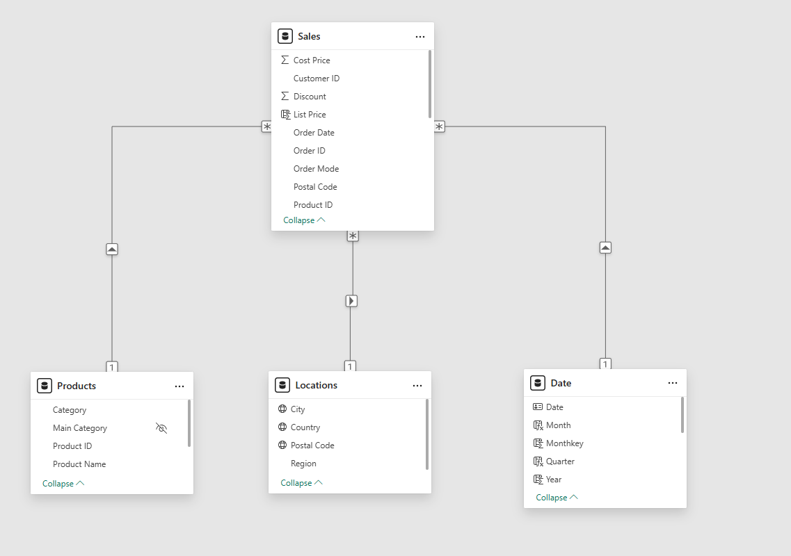
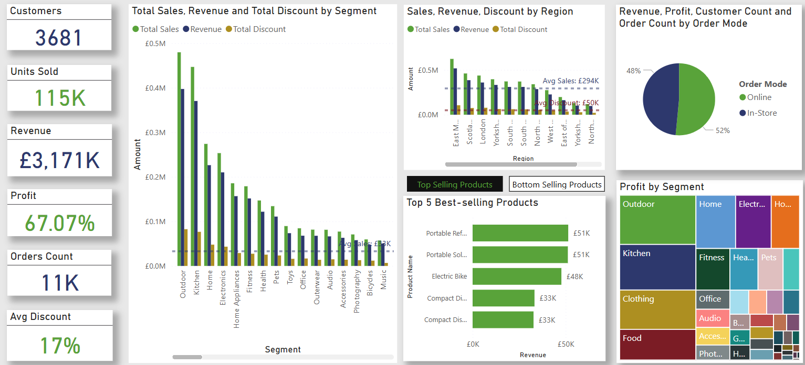
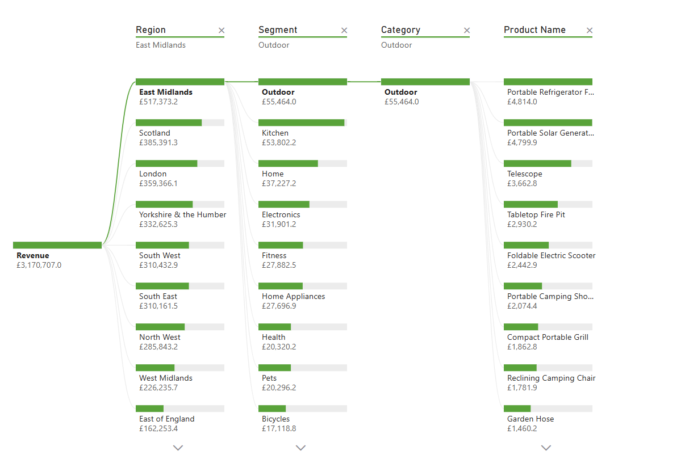

# RDAMP-Sales-Analysis_Vineet_Khurama

 ACE Superstore Sales Analysis

## About the Project

This project was completed as part of the **Realcare Tech Mark Ltd Data Analytics Mentorship Program**, which provides hands-on experience with real-world datasets to build data analytics skills and industry-ready dashboards.

---

## Objective

Analyze the sales data of **Ace Superstore** to:

- Identify regional performance gaps
- Understand customer behaviour patterns
- Evaluate product category profitability

These insights support strategic decision-making for business growth.

---

## Dataset

- **Sales** [Order ID], [Order Date], [Order Mode], [Customer ID], [City], [Postal Code], [Country], [Region], [Product ID], [Product Name], [Category], [Sub Category], [Sales], [Cost], [Quantity], [Discount]
- **Locations** [City], [Postal Code], [Country],  [Region]

---

## Tool Used

- **Power BI**

---

## Data Preparation & ETL

Performed ETL (Extract, Transform, Load) using Power BI and Power Query:

1. Removed duplicate columns ([City], [Country], [Region]) from the Sales table
2. Cleaned null values in **Category** and **Discount** fields
3. Updated data types:
   - `[Sales]`, `[Cost]` → Fixed Decimal
   - `[Quantity]`, `[Discount]` → Whole Number
4. Removed entries with negative values in `[Sales]` and `[Cost]`
5. Removed duplicates from the Locations table
6. Created **Products Dimension Table** from Sales with: `[Product ID]`, `[Product Name]`, `[Category]`, `[Sub Category]`
7. Removed duplicates from the Products table
8. Removed product-related columns from the Sales table to make it a **Fact Table**
9. Built **Date Dimension Table** using `CALENDAR()`
10. Added columns to Date table: `[Month]`, `[Year]`, `[Quarter]`, `[MonthKey]`
11. Created date hierarchy: `[Year] > [Quarter] > [Month] > [Date]`
12. Used Extract function and delimiter '-' to generate **Segment** column from Category
13. Used DAX `IF()` to fill empty values in Category fields
14. Added `[List Price]` column: `List Price = Sales / (1 - Discount)`

---

## Data Modeling

Established a star schema model:

1. **Sales ↔ Location**: Many-to-One via `[Postal Code]`
2. **Sales ↔ Date**: Many-to-One via `[Order Date]` = `[Date]`
3. **Sales ↔ Products**: Many-to-One via `[Product ID]`

---

## Measures (KPIs)

Developed DAX measures to calculate:

1. Total Cost
2. Revenue
3. Total Sales
4. Profit
5. Profit%
6. Total Discount
7. Discount%
8. Quantity Sold
9. Customer Count
10. Order Count

---

## Visualizations

1. **Stacked Column Chart**: Revenue, Total Sales, and Discount by **Segment**
2. **Stacked Column Chart**: Revenue, Total Sales, and Discount by **Region**
3. **Pie Chart**: Revenue split by **Online vs In-store**
4. **Bar Charts**: Top 5 and Bottom 5 selling products (with bookmark navigation)
5. **Treemap**: Profit by **Category**
6. **Decomposition Tree**: Revenue breakdown by Segment → Category → Subcategory → Product
7. **Key Insights Page**: Displays strategic recommendations
8. **Overview Page**: Page navigation across report pages
9. **Back Button Navigation**: Enabled on Sales Analysis and Summary pages

---

## Summary

- Presented actionable insights on sales trends, profitability, and customer preferences
- Offered strategic recommendations for improving performance and profitability

---

## Power BI report

[Access the Power BI report](https://github.com/vibvinit/RDAMP-Sales-Analysis/blob/main/Vineet_Khurana_Sales_Report.pbix)

---

## Report Screenshots

----

----

----

----
